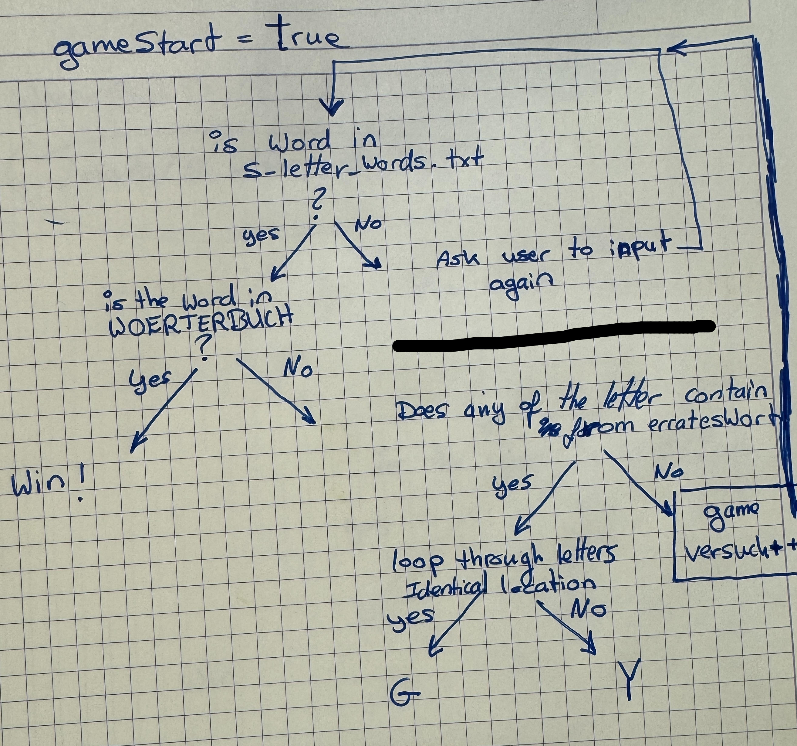
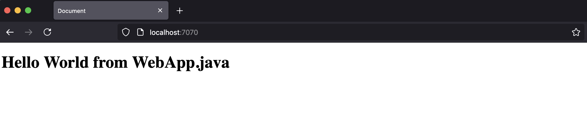

# ipro-Wordle

Wordle Game in Java
Individuelles Softwareprojekt (ipro)

| Nachname | Vorname | Projektname | Betreuung |
|----------|---------|-------------|-----------|
| B.       | Avi     | Wordle      | A. A.     |

⸻

## Project Overview

This project implements a simplified Wordle-style game in Java as part of the Individuelles Softwareprojekt (ipro).

### The project follows an incremental approach:

1. implement and validate the complete game logic as a console application
2. reuse the existing logic in a simple web application using Javalin, HTML, CSS, and JavaScript

The main focus is on:

- clear and correct game logic
- input validation
- incremental development
- separation of logic and presentation

Advanced features such as multiplayer are intentionally out of scope.

⸻

## Our Methodology

We use an **Incremental Delivery** approach, illustrated by Henrik Kniberg’s
*Skateboard → Bicycle → Motorcycle → Car* metaphor.


*Image source and original post: [Henrik Kniberg – Making sense of MVP](https://blog.crisp.se/2016/01/25/henrikkniberg/making-sense-of-mvp)*

This project follows Henrik Kniberg’s interpretation of MVP, where the focus is on
delivering the **earliest usable version of the product**, rather than incomplete
technical components.

Instead of building unfinished fragments of a web application, the project starts
in the first week with a **fully playable console-based Wordle game** (the “Skateboard”).
This ensures real usability and enables meaningful feedback from the beginning.

Each subsequent increment (week) improves the product in terms of usability,
interface, and delivery, while **preserving a working, testable application at every
stage**, reducing risk and supporting continuous learning.

⸻

## Game Rules & Conventions

### Game Rules & Conventions

Symbol Meaning
G	Correct letter in the correct position
Y	Correct letter in the wrong position
B	Letter not contained in the target word

### Example Dictionary (5-letter words)

Examples used during development:

AARAU, BASEL, BRUGG, DATEI, MODUL, LOGIK

⸻

## Game Logic (Conceptual Overview)

The Wordle game logic follows these steps:

1. Define a dictionary containing valid 5-letter German words
2. Read user input
3. Validate input:
	- exactly 5 characters
	- word must exist in the dictionary (5_letter_words.txt)
4. Compare the input word with the target word
5. Generate feedback per character (G, Y, B)
6. Output feedback
7. Increase the attempt counter
8. End the game on success or after 6 attempts

⸻

## Core Variables

The following variables are used in the game logic:

- String[] WOERTERBUCH – list of valid words
- String erratenesWort – user input word
- int versuche – attempt counter
- String feedback – feedback string (G, Y, B)

⸻

## Diagrams & Screenshots

### Game Logic Draft (Console Version)

The following diagram illustrates the control flow of the console-based
Wordle implementation, including input validation, feedback generation,
and termination conditions.



⸻

### Web Application Architecture (Planned)

This diagram shows the planned interaction between the web frontend
(HTML, CSS, JavaScript) and the Java backend implemented using Javalin.


Web Frontend:

- index.html
- styles.css
- script.js
Java Backend:
- Main.java (game logic)
- WebApp.java (Javalin server setup)

We successfully installed Javalin, maven dependencies, and set up a basic server:

Command to run the web app:

```bash
mvn clean package
java -jar target/wordle-1.0-SNAPSHOT.jar
```

in browser:

```bash
http://localhost:7070
```



### Deployment idea:

We can deployed the app on Render that has a simple GitHub integration and straightforward support for running Java app.

⸻

## Random Word Selection

A random target word is selected from the dictionary:

```java
String zufallsWort =
    WOERTERBUCH[(int)(Math.random() * WOERTERBUCH.length)];
```

Reference:
https://stackoverflow.com/a/7923141

⸻

## Console vs Web Version

### Console Version

- Uses Scanner for user input
- Outputs feedback as characters (G, Y, B)
- Focuses exclusively on correct game logic

### Web Version (Planned / In Progress)

- Java backend implemented with Javalin
- Frontend using HTML, CSS, JavaScript
- Visual feedback (green/yellow/grey) handled via CSS
- Game logic reused from the console version

⸻

Using the Maven Archetype to Set Up the Project

To set up the project using Maven Archetype, run the following command:

```bash
mvn archetype:generate
```

creating a basic project structure with necessary files.

```tree
- creates pom.xml
- creates src/main/java
- creates src/test/java
- sets groupId / artifactId
```

## Project Structure (Web Version)

To best organize the project for the web version and game logic we use the following structure:

```tree
src/
 ├─ main/
 │  ├─ java/
 │  │  └─ app/
 │  │     └─ Main.java        (Game logic)
 │  │     └─ WebApp.java      (Javalin server setup)
 │  └─ resources/
 │     ├─ public/             (HTML, CSS, JS)
 │     └─ data/
 │        └─ 5_letter_words.txt
pom.xml
```

⸻

## Word List Source

The list of valid German words is based on:

enz/german-wordlist
License: CC0-1.0

Source:

- https://github.com/enz/german-wordlist
- File: words (UTF-8, one word per line)

Usage in this project:

- Filter words with exactly 5 letters
- Convert all words to uppercase
- Store the result in 5_letter_words.txt

⸻

## Learning Resources & References

- Build a Wordle Clone in Java
https://medium.com/strategio/build-a-wordle-clone-in-java-c7b7b924fb8d
- Leverage Java 17 New Features to Create Your Wordle Checker – JEP Café #10
https://inside.java/2022/02/22/jepcafe10/

Note:
Although the video uses Java 17 features, it was mainly used for conceptual understanding.

### Credits & Acknowledgements

- Marco B. — for feedback, discussions, and practical support during development.
- ChatGPT (OpenAI) — used as a supportive tool for explanations, wording improvements, and structuring documentation.
- Javalin Documentation and Tutorials — for guidance on setting up the web server.
https://javalin.io/documentation

All external technical resources (Stack Overflow, articles, and word lists) are credited in the relevant sections above.

⸻

## Project Goal

The goal of this project is to demonstrate:

- understanding of basic Java programming
- incremental software development
- clean and maintainable code
- transition from a console application to a simple web application

The project scope is intentionally limited to ensure reliability and
clarity within a pass/fail evaluation context.