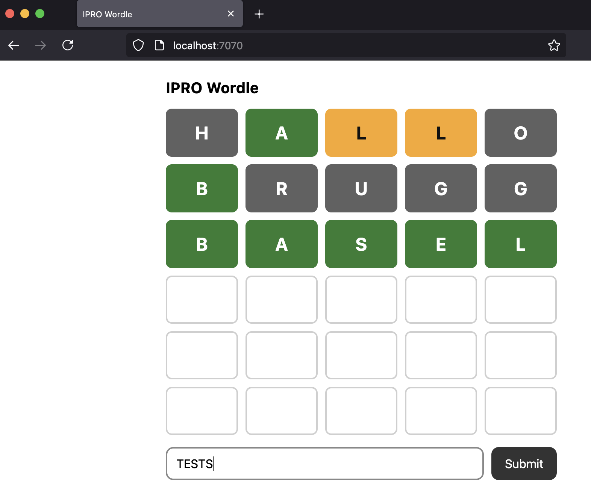
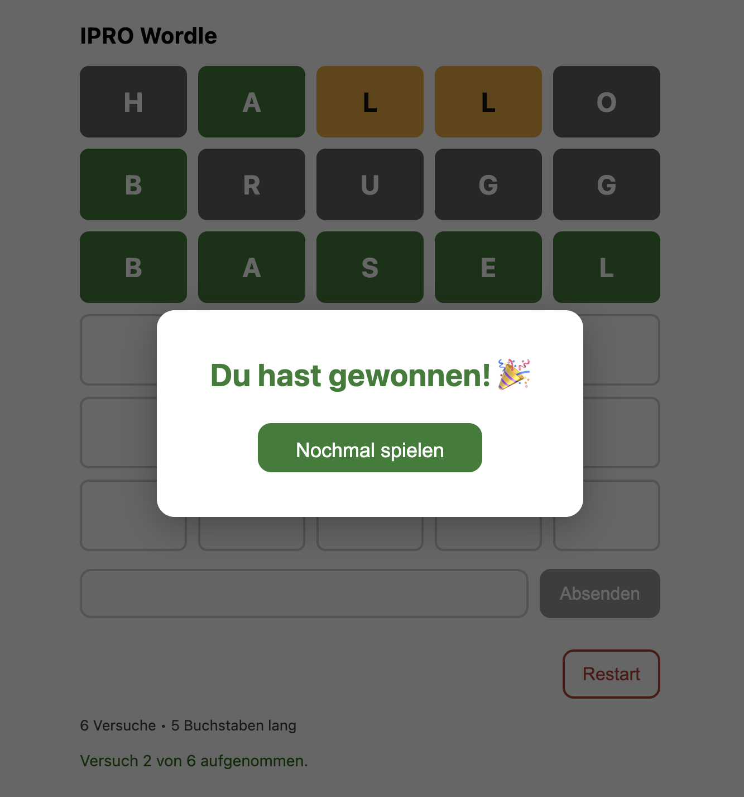

# ipro-Wordle

**Status:** Work in progress.  
This README evolves alongside the project. Sections for later weeks describe planned work and will be expanded as implementation progresses.

⸻

## Project Overview

This project implements a simplified Wordle-style game in Java as part of the Individuelles Softwareprojekt (ipro).

The main focus is on:

- clear and correct game logic
- input validation
- incremental development
- separation of logic and presentation

Advanced features such as multiplayer are intentionally out of scope.

⸻

## Project Scope & Constraints

The project scope is intentionally limited to ensure reliability and clarity within a pass/fail evaluation context.

The goal is to demonstrate:

- understanding of basic Java programming
- incremental software development
- clean and maintainable code
- transition from a console application to a simple web application

⸻

## Methodology

We use an **Incremental Delivery** approach, illustrated by Henrik Kniberg’s *Skateboard → Bicycle → Motorcycle → Car* metaphor.


*Image source and original post: [Henrik Kniberg – Making sense of MVP](https://blog.crisp.se/2016/01/25/henrikkniberg/making-sense-of-mvp)*

This project follows Henrik Kniberg’s interpretation of MVP, where the focus is on delivering the **earliest usable version of the product**, rather than incomplete technical components.

Instead of building unfinished fragments of a web application, the project starts in the first week with a **fully playable console-based Wordle game** (the “Skateboard”). This ensures real usability and enables meaningful feedback from the beginning.

Each subsequent increment (week) improves the product in terms of usability, interface, and delivery, while **preserving a working, testable application at every stage**, reducing risk and supporting continuous learning.

⸻

## Development Timeline

### Week 1 – Console Game (Completed)

The initial increment implements and validates the complete game logic as a console application.

#### Dictionary and Input

- An initial minimal dictionary of example 5-letter words is used during early development:

  ```list
  AARAU, BASEL, BRUGG, DATEI, MODUL, LOGIK
  ```

- Later, a filtered German word list (`5_letter_words.txt`) is used for validation.

#### Game Logic Steps

1. Define a dictionary containing valid 5-letter German words.
2. Read user input.
3. Validate input:
   - Exactly 5 characters.
   - Word must exist in the dictionary (`5_letter_words.txt`).
4. Compare the input word with the target word.
5. Generate feedback per character using the following scheme:
   - **G**: Correct letter in the correct position.
   - **Y**: Correct letter in the wrong position.
   - **B**: Letter not contained in the target word.
6. Output feedback.
7. Increase the attempt counter.
8. End the game on success or after 6 attempts.

#### Core Variables

- `String[] WOERTERBUCH` – list of valid words.
- `String erratenesWort` – user input word.
- `int versuche` – attempt counter.
- `String feedback` – feedback string (G, Y, B).

#### Letter-by-Letter Comparison Logic

The feedback generation compares each letter of the guessed word to the target word, marking letters as:

- **G** when the letter is correct and in the correct position.
- **Y** when the letter exists in the target word but in a different position.
- **B** when the letter does not appear in the target word.

This logic supports user understanding of the guess accuracy.

#### Random Word Selection

A random target word is selected from the dictionary:

```java
String zufallsWort =
    WOERTERBUCH[(int)(Math.random() * WOERTERBUCH.length)];
```

Reference: https://stackoverflow.com/a/7923141

#### Diagram: Game Logic Draft

The following diagram illustrates the control flow of the console-based Wordle implementation, including input validation, feedback generation, and termination conditions.


⸻

### Week 2 – Web Foundation (Completed)

This increment reuses the existing console game logic in a simple web application using Javalin, HTML, CSS, and JavaScript.

#### Backend Setup

- Java backend implemented with Javalin.
- Maven project structure set up using archetype:
  
  ```bash
  mvn archetype:generate
  ```
  
  Creating:

  ```markdown
  - pom.xml
  - src/main/java
  - src/test/java
  - groupId / artifactId
  ```

- Basic server setup confirmed with a "Hello World" example.

### Command to build and run the web app

```bash
mvn clean package && java -jar target/wordle-1.0-SNAPSHOT.jar
```

#### Frontend Implementation

- Basic frontend built with HTML, CSS, and JavaScript.
- Provides input elements and styling.
- Communicates with the Java backend via simple **GET** and **POST** requests using Javalin.

#### Functional Description

Week 2 delivers a functional but minimal web "scooter" — connected, playable, but intentionally simple.

Initial web app screenshots:


After integrating frontend (HTML, CSS and JavaScript):




For more technical details see wiki:  
[Frontend & Backend Technology Overview](https://github.com/inspiringsource/ipro-wordle-public/wiki/Frontend-&-Backend-Technology-Overview)

⸻

### Week 3 – Full Web Gameplay (Planned / In Progress)

This increment aims to extend the web application with full gameplay features.

#### Planned Features

This week features included:

- Improvement of Randomly select a German word from `5_letter_words.txt` as WOERTERBUCH word.
- JavaScript modal popup for win/lose messages and menu:
  - Reset game functionality.
  - Lose condition (after 6 attempts).
  - Win condition (all letters correct).
- Other improvements including CSS styling and js effects prep for week 4.



javascript code from [w3schools.com/](https://www.w3schools.com/howto/howto_css_modals.asp)

### Week 4 – Final Enhancements (Planned)

#### Possible Refinements

- Deployment on Render with GitHub integration for continuous delivery.
- Enhanced user interface and interaction.
- Additional input validation and feedback enhancements.

⸻

## Game Rules & Feedback System

The Wordle game uses the following symbols to provide feedback on user guesses:

| Symbol | Meaning                       |
|--------|-------------------------------|
| G      | Correct letter in correct position |
| Y      | Correct letter in wrong position   |
| B      | Letter not contained in the target word |

This feedback guides players towards the correct word within 6 attempts.

⸻

## Game Logic Overview

The Wordle game logic consists of:

- Selecting a random target word from the dictionary.
- Reading and validating user input.
- Comparing the guess to the target word.
- Generating per-letter feedback (G, Y, B).
- Tracking the number of attempts.
- Ending the game on success or after 6 attempts.

This logic is implemented in Java and designed to be reused across console and web interfaces.

⸻

## Data & Dictionary Handling

The list of valid German words is based on:

- Repository: enz/german-wordlist
- License: CC0-1.0
- Source URL: https://github.com/enz/german-wordlist
- File: `words` (UTF-8, one word per line)

Processing steps:

- Filter words with exactly 5 letters.
- Convert all words to uppercase.
- Store the result in `5_letter_words.txt`.

Rationale:

- Simple uppercase comparison avoids locale or regex complexity at runtime.
- Ensures consistent validation and feedback generation.

⸻

## Project Structure

The project is organized to support incremental development and clear separation of concerns.

```tree
src/
 └─ main/
    ├─ java/
    │  └─ app/
    │     ├─ Main.java        (Game logic – console version)
    │     └─ WebApp.java      (Javalin server & API endpoints)
    └─ resources/
       ├─ data/
       │  └─ 5_letter_words.txt   (Dictionary)
       └─ public/
          └─ index.html           (Web frontend)
pom.xml
```

Advantages:

- Clear separation between game logic and web server code.
- Supports reuse across interfaces.
- Facilitates maintainability.

⸻

## Deployment & Execution

To set up the project using Maven Archetype, run:

```bash
mvn archetype:generate
```

To build and run the web application:

```bash
mvn clean package && java -jar target/wordle-1.0-SNAPSHOT.jar
```

Access the web app in a browser at:

```bash
http://localhost:7070
```

⸻

## References & Credits

- Build a Wordle Clone in Java  
  https://medium.com/strategio/build-a-wordle-clone-in-java-c7b7b924fb8d

- Leverage Java 17 New Features to Create Your Wordle Checker – JEP Café #10  
  https://inside.java/2022/02/22/jepcafe10/

  *Note:* Although the video uses Java 17 features, it was mainly used for conceptual understanding.

- Javalin Documentation and Tutorials  
  https://javalin.io/documentation

- Word list source: enz/german-wordlist (CC0-1.0)  
  https://github.com/enz/german-wordlist

### Credits & Acknowledgements

- Marco B. — feedback, discussions, and practical support during development.
- ChatGPT (OpenAI) — supportive tool for explanations, wording improvements, and structuring documentation.
- Henrik Kniberg — MVP metaphor inspiration.
- Stack Overflow and other technical resources cited within the document.

⸻

## Project Goal

The goal of this project is to demonstrate:

- understanding of basic Java programming
- incremental software development
- clean and maintainable code
- transition from a console application to a simple web application

The project scope is intentionally limited to ensure reliability and clarity within a pass/fail evaluation context.

⸻

| Nachname | Vorname | Projektname | Betreuung |
|----------|---------|-------------|-----------|
| B.       | Avi     | Wordle      | A. A.     |